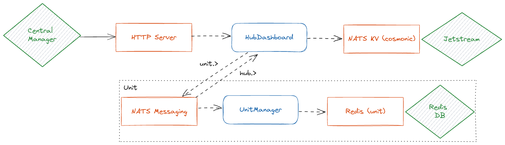

# Industry Inventory Demo

The industry inventory is a sample application that demonstrates how wasmCloud actors can be used to build a distributed application. The application is a simple inventory management system that lets a central server track the inventory of a number of warehouses or hubs. The inventory items tracked are generic and can meet the needs of any industry. The application is built using the following components:

1. [Unit Inventory](): a wasmCloud actor that provides a web-based dashboard and RESTful API for managing the inventory of a single warehouse or unit. This is designed to be deployed on a Raspberry Pi or other small device that can be placed in a warehouse or unit.
1. [Hub Dashboard](): a wasmCloud actor that provides a web-based dashboard for a hub. The dashboard allows the user to view the inventory of every and to add or remove items from the inventory. This is designed to be deployed in a central location like a cloud and to be used by a hub manager.

## Architecture

